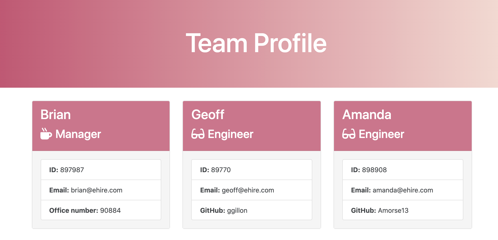

# Team-Profile-Generator

## Table of Contents
* [Description](#description)
* [Installation](#installation)
* [Contributing](#contributing)
* [Visuals](#visuals)
* [Demonstration](#demonstration)
* [Support](#support)

## Description
Team-Profile-Generator is a Node CLI that takes in information about employees and generates an HTML webpage that displays summaries for each person. Upon running the command, "node app.js", the application will prompt the user for information about the team manager and then information about the team members. The user can input any number of team members, and they may be a mix of engineers and interns. Once the user has completed building the team, the application will generate an HTML file that displays a nicely formatted team roster based on the information provided by the user. 

## Installation
This application requires the following node packages:
* Jest
* Inquirer

To install, run "npm install" in your Command Line System.

## Visuals

## Demonstration
https://drive.google.com/file/d/1PnFMaZqRjpIH_CuQF-nkAmZiLQNv82pr/view

## Contributing
Pull requests are welcome. For major changes, please open an issue first to discuss what you would like to change. 

Please make sure to update tests as appropriate.

## Support
For questions, comments or concerns regarding the Team-Profile-Generator, please email barrettpope94@gmail.com.
